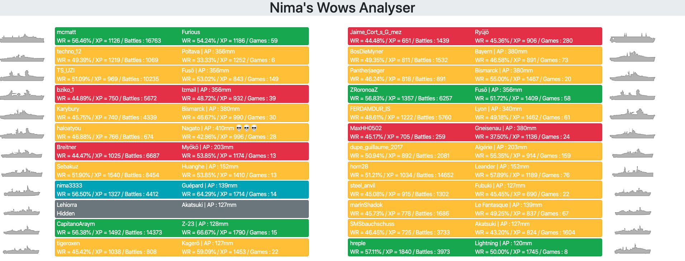

# Nima's Wows Analyser

This application aims to provide live games statistics (players stats in particular) for World of Warships.

It's a local webserver, so you just need python and a browser to run it.

## Installation

You have first to install Python (procedure not explained here).
</br>Then, install the requirements :
```
pip3 install -r requirements.txt
```
TODO : complete (config.py, ...)

## Usage

First, launch the python script:
```
python3 ./webpage.py
```
Then, open your favorite browser and go to http://127.0.0.1:5000/.

## Image


